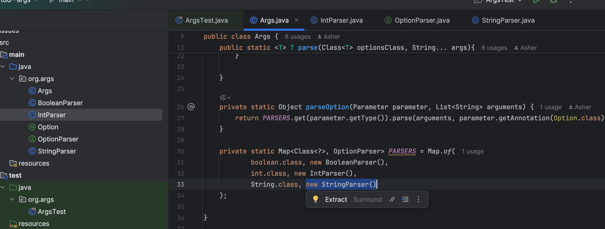

# TDD 工作流程

## 需求分析

清晰的产品定义（因为是单一的一个模块和服务，不需要考虑这个）

1. 【以终为始】产出物是什么？（输入，输出）

   * 形态：Java解析类

   * 输入：

     样例一： `-l -p 8080 -d /usr/logs`

     样例二：`-g this is a list -d 1 2-3 5`

   * 输出：

     1. 参数与模式匹配

        没有默认值，则指定默认值

     2. 参数与模式不匹配， 给出错误信息

## 【概要设计】产出物的规格应该是什么样的？

   解析方法的规格

   * 使用 JDBC 传统的写法 

   * 使用 Anotation 的方式 ✅
     

     

## 【详细设计】（数据结构 + 算法）

   数据结构

   * 思路一：根据下标直接进行读取

   * 思路二：根据标位出现的位置进行分段，分段数组

   * 思路三：Map

   算法 TODO

## 把最终要实现的功能（样例）写成测试

注意事项：如果根据上面的测试驱动开发，步子太大了，处理的情况太多了

* bool 型
* 整型
* string 型
* 字符串数组型
* 整型数组型

TDD 是通过一系列的测试控制我们整个研发的节奏，所以我们要控制测试的粒度，不能太大


有没有什么通过一步，两步，三步这样的方式进行开发？并且让我们的第一个测试尽快通过测试？

* 考虑  happy path

  * 分而治之，分解成单独的任务
  * 合并

* 考虑 Sad Path

* 考虑 default value
  

## 产出任务列表

大概10个测试的样子，到第四个测试的时候，我们要的第一个功能从正向来看就实现了


```
// Single Option:
// TODO:      - Bool -l
// TODO:      - Integer -p 8080
// TODO:      - String -d /usr/logs
// TODO:      - multi options: -l -p 8080 -d /usr/logs

// sad path:
// TODO:      - bool -l t / -l t f
// TODO:      - int -p / -p 8080 8081
// TODO:      - string -d / -d /usr/logs /usr/vars

// default value
// TODO:      - bool : false
// TODO:      - int : 0
// TODO:      - string ""
```

## Before 进入红绿重构循环

1. Disable example test
2. Make the code pass compilation quickly.


## 进入First 红绿重构循环

3 Status:

* TODO 
* ~~xxxTask~~  Finished
* **// TODO:  XXX** in progress


任务列表

> // Single Option:
> **// TODO:      - Bool -l**
> // TODO:      - Integer -p 8080
> // TODO:      - String -d /usr/logs
> // TODO:      - multi options: -l -p 8080 -d /usr/logs
>
> // sad path:
> // TODO:      - bool -l t / -l t f
> // TODO:      - int -p / -p 8080 8081
> // TODO:      - string -d / -d /usr/logs /usr/vars
>
> // default value
> // TODO:      - bool : false
> // TODO:      - int : 0
> // TODO:      - string ""


### Red Failed Test


### Fix Red test in the quick

（最简单的方式实现，不要考虑边界，并且不要担心犯下的任何罪恶，强迫你编程）


### 如何让上面的代码变成我最终要实现的功能？-- 写相反的情况


### Green


## Update Task List

Mark the Task as finished

- // Single Option:
  * ~~// TODO:      - Bool -l~~
  * **// TODO:      - Integer -p 8080**
  * // TODO:      - String -d /usr/logs
  * // TODO:      - multi options: -l -p 8080 -d /usr/logs
- // sad path:
  - // TODO:      - bool -l t / -l t f
  - // TODO:      - int -p / -p 8080 8081
  - // TODO:      - string -d / -d /usr/logs /usr/vars
- // default value
  * // TODO:      - bool : false
  * // TODO:      - int : 0
  * // TODO:      - string ""


## 进入后续红绿重构循环

注意：

1. 如何写测试的时候就不要动生产代码
2. 如何写生产代码的时候就

## 考虑是否要进行重构？

进入重构的条件：

1. 第一是测试都是绿的，也就是当前功能正常（Green）
1. 第二是坏味道足够明显。（Bad Smell）


当前代码是否满足两个条件

1. green ✅
2. bad smell ✅
   1. 一个明显的面向对象误用的坏味道——分支语句（Switch Statements、Object-Oriented Abusers）
      重构手法：利用多态替换条件分支（Replacing Conditional with Polymorphism）


利用多态替换条件分支（Replacing Conditional with Polymorphism）


## 开始重构

1. 设计

2. delegate 然后 inline 旧实现


去掉手术台，改变代码调用链路。


## 开始重构2 -- 代码结构的重复 

解决方案：

1. 策略模式 Stratege pattern 
2. 利用函数式编程 
   1. 把String.valueOf(value); 变成 function field


能不能把父类中别被子类覆盖的方法删掉呢？

1. 把父类中别被子类覆盖的方法的主体提取成一个 Field （Extract Funtional Field）
   

2. ...

3. 方式1:
   最后使用 StringParser 的地方可以用 New IntParser() 的方式书写，然后把 函数（String::valueOf）传过去，这样，就合二为一了。
   

   

   方式2:
   将构造函数变成工厂方法
   https://www.jetbrains.com/help/idea/replace-constructor-with-factory-method.html
   

 

