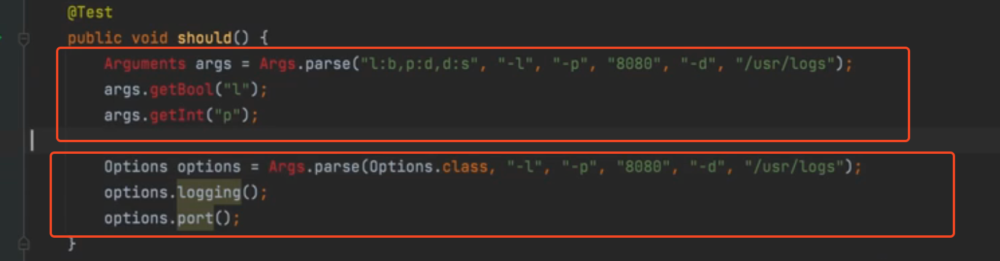

## TDD 工作流程

1. 需求分析

   清晰的产品定义（因为是单一的一个模块和服务，不需要考虑这个）

2. 【以终为始】产出物是什么？（输入，输出）

   * 形态：Java解析类

   * 输入：

     `-l -p 8080 -d /usr/logs`

   * 输出：

     1. 参数与模式匹配

        没有默认值，则指定默认值

     2. 参数与模式不匹配， 给出错误信息

3. 【概要设计】产出物的规格应该是什么样的？

   解析方法的规格

   * 使用 JDBC 传统的写法 

   * 使用 Anotation 的方式 ✅
     

     

4. 【详细设计】（数据结构 + 算法）

   数据结构

   * 思路一：根据下标直接进行读取

   * 思路二：根据标位出现的位置进行分段，分段数组

   * 思路三：Map

   算法 TODO

5. 把最终要实现的功能（样例）写成测试

6. 产出任务列表

