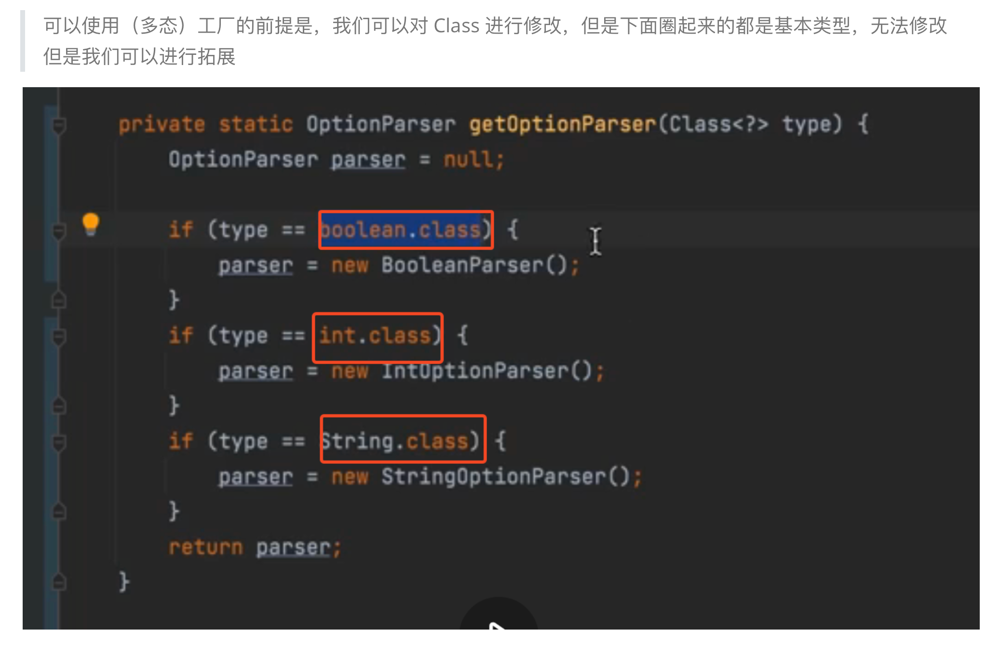

## TODO
1. learn to use record
eg:
```
static record Options(@Option("-l")boolean logging, @Option("-p")int port, @Option("-d")String directroy){}
```
2.  How to write annatation ?

```
import java.lang.annotation.ElementType;
import java.lang.annotation.Retention;
import java.lang.annotation.RetentionPolicy;
import java.lang.annotation.Target;

@Retention(RetentionPolicy.RUNTIME)
@Target({ElementType.PARAMETER})
public @interface Option {
}
```


## TODO 设计模式

思考：为什么  ？

**使用（多态）工厂的前提是，我们可以对 Class 进行修改**，但是下面圈起来的都是基本类型，无法修改
但是我们可以进行拓展




## TODO java 9 引入的 map.of

