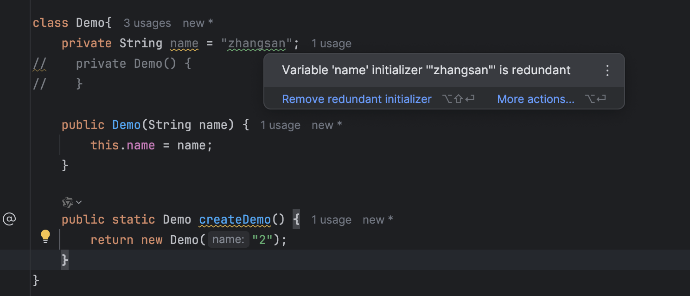

## TODO
1. learn to use record
eg:
```
static record Options(@Option("-l")boolean logging, @Option("-p")int port, @Option("-d")String directroy){}
```
2.  How to write annatation ?

```
import java.lang.annotation.ElementType;
import java.lang.annotation.Retention;
import java.lang.annotation.RetentionPolicy;
import java.lang.annotation.Target;

@Retention(RetentionPolicy.RUNTIME)
@Target({ElementType.PARAMETER})
public @interface Option {
}
```


## TODO 设计模式

思考：为什么  ？

**使用（多态）工厂的前提是，我们可以对 Class 进行修改**，但是下面圈起来的都是基本类型，无法修改
但是我们可以进行拓展


## TODO java 9 引入的 map.of


## TODO java 语法 Integer::parseInt


## TODO 思考

为什么说是多余的？

> Variable 'name' initializer '"zhangsan"' is redundant 
>  Inspection info: Reports assignment values that are not used after assignment. If the assignment value is unused, it's better to remove the assignment to shorten the code and avoid redundant allocations.
> The following cases are reported:
> variables that are never read after assignment
> variables that are always overwritten with a new value before being read
> variable initializers that are redundant (for one of the two reasons above)



```
class Demo{
    private String name = "zhangsan";
//    private Demo() {
//    }

    public Demo(String name) {
        this.name = name;
    }

    public static Demo createDemo() {
        return new Demo("2");
    }
}
