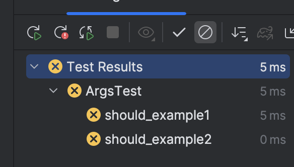
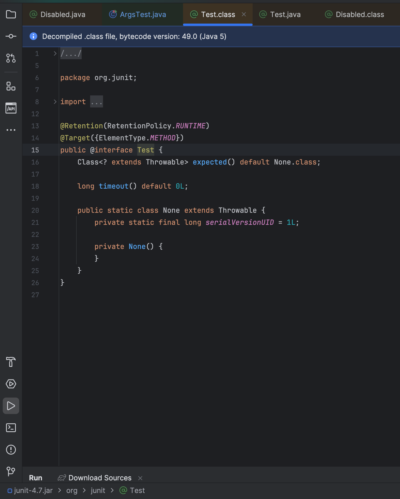
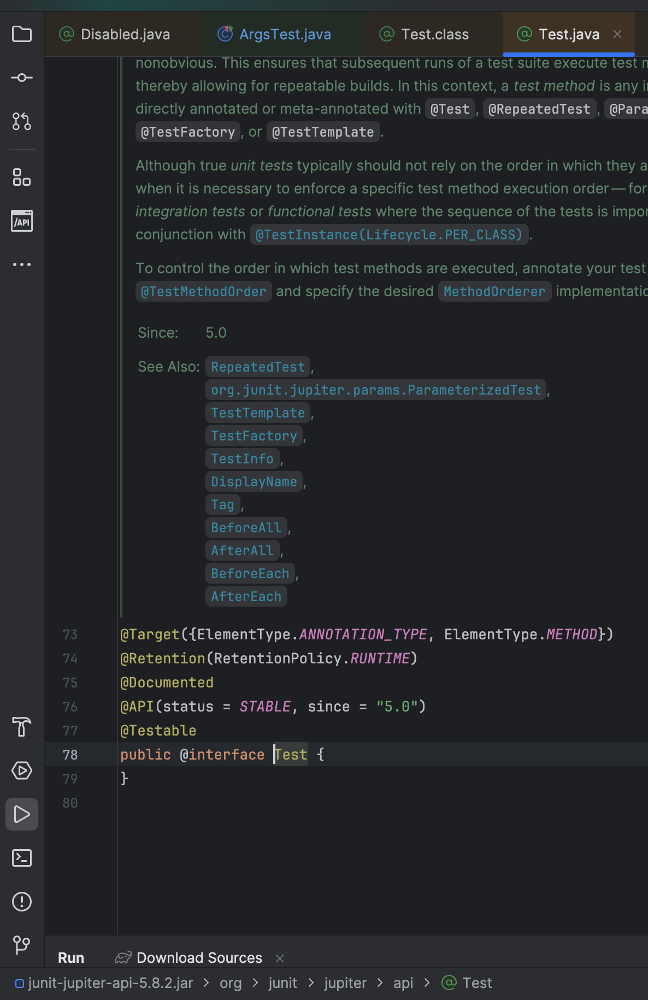

## Issue description

```
import org.junit.Test;
import org.junit.jupiter.api.Disabled;
```

@Disable does not work



## @Disabled


## import org.junit.Test;

```
import org.junit.Test;
import org.junit.jupiter.api.Disabled;
```

> 4.7
>
> import org.junit.Test; 



## import org.junit.jupiter.api.Test;

```
import org.junit.jupiter.api.Test;// changed
import org.junit.jupiter.api.Disabled;
```





