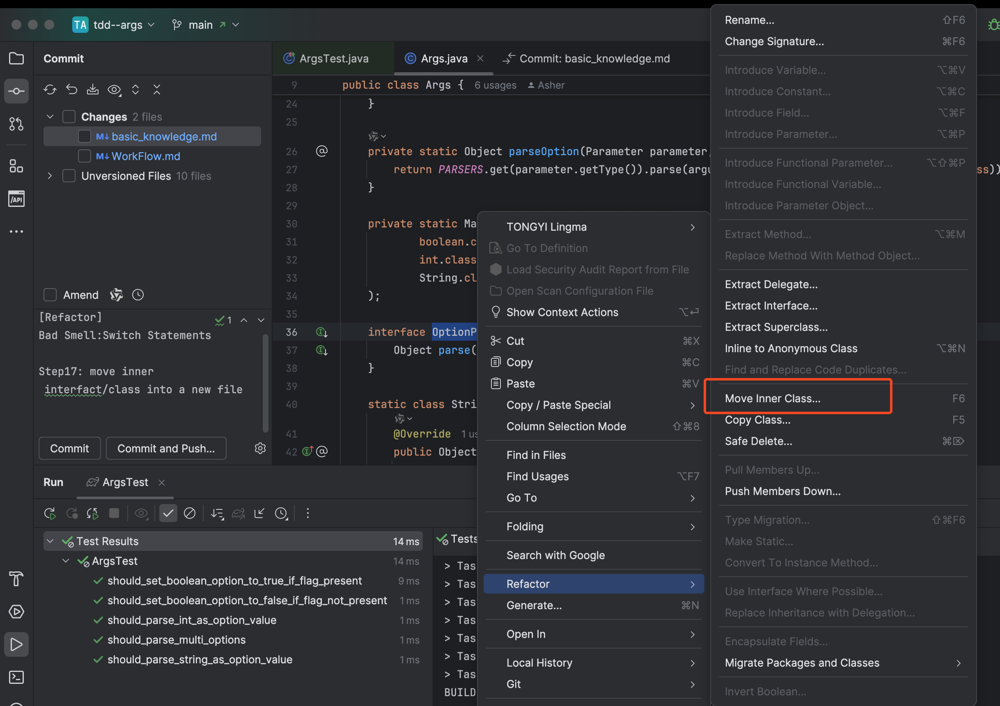
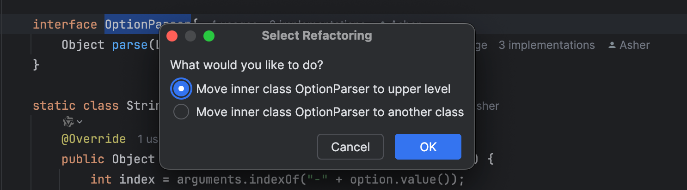
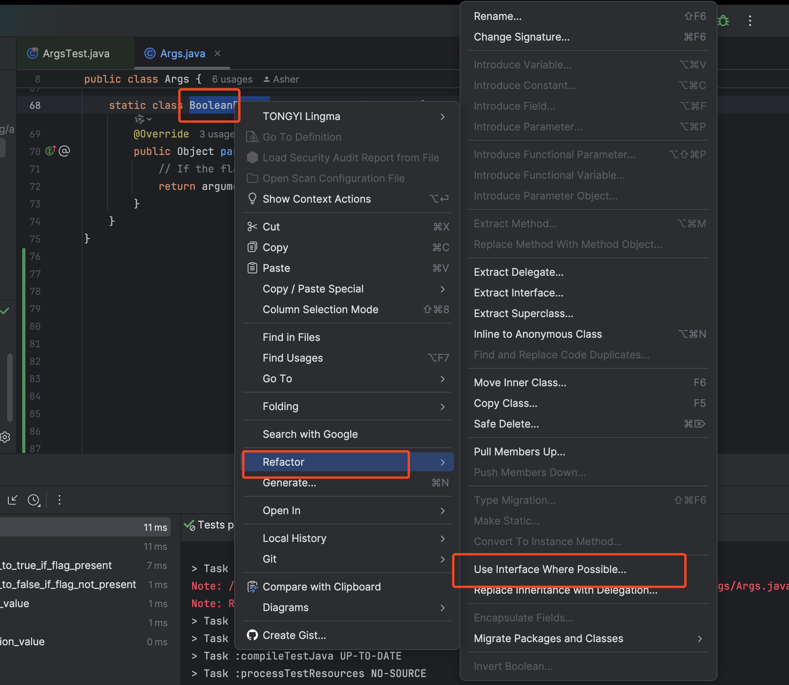
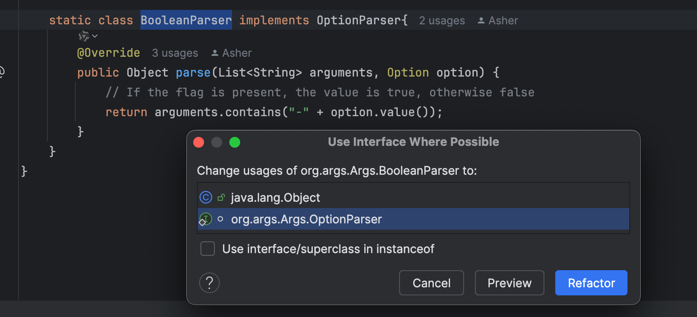
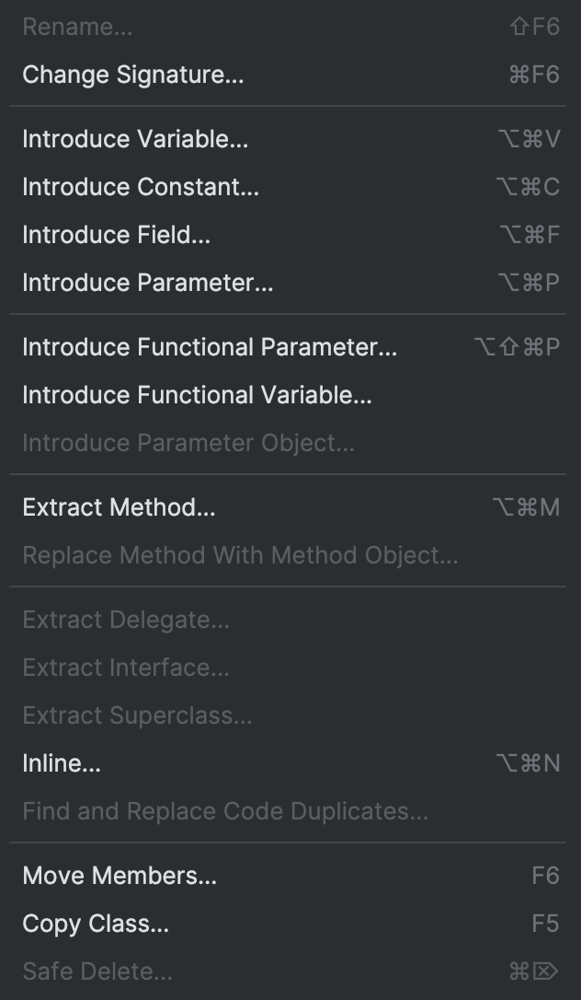

## list

* Extract variable

  option + cmd + V

* Extract method

  option + cmd + M

* Inline variable 

  option + cmd + N

* Move inner class

  F6

* Replace constructor with factory method.

  option + enter

## 展开

* Extract variable

  option + cmd + V

* Extract method

  option + cmd + M

* Inline variable 

  option + cmd + N

* Move inner class

  F6

  

  

  

* Use interface where possible

  

  

